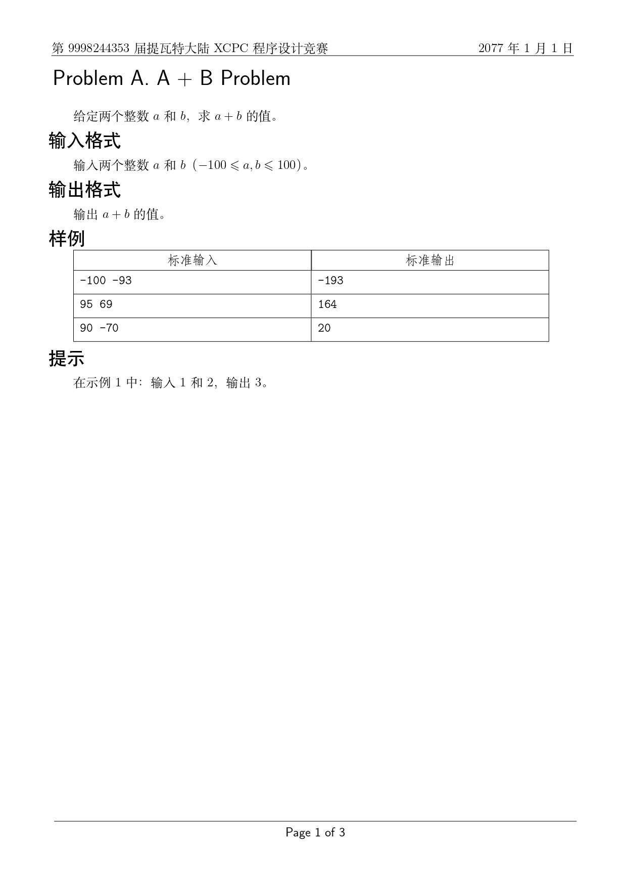
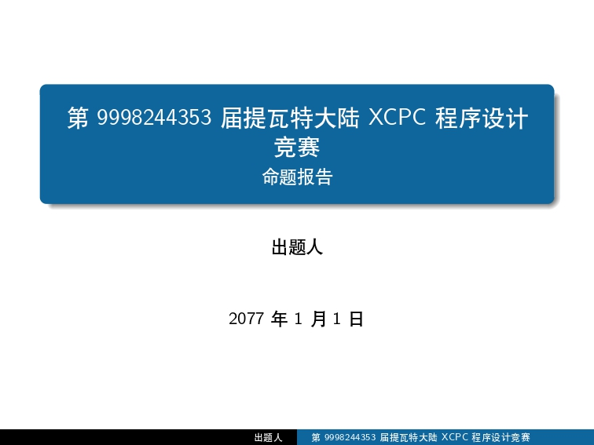
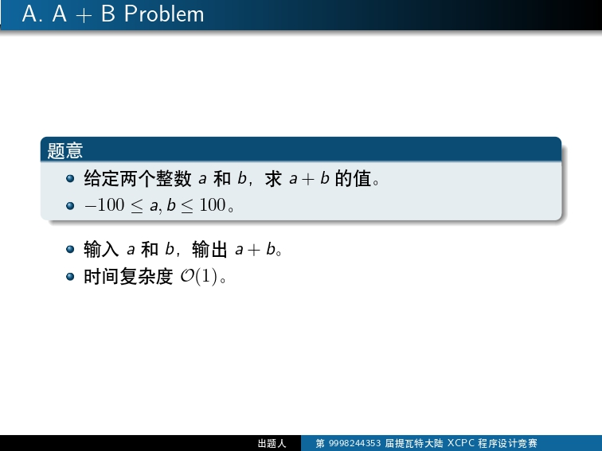
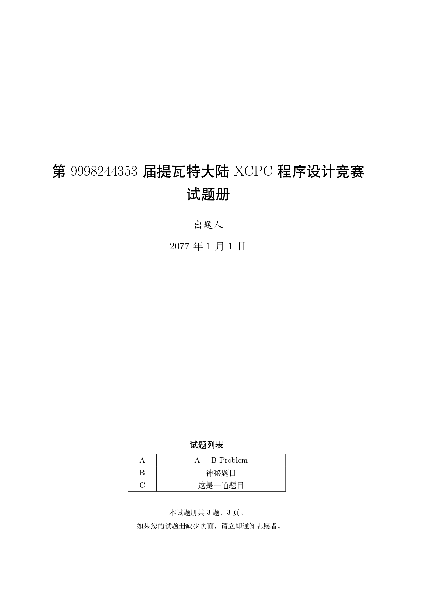

# Polygon Chinese Template

提供使用 Polygon 创建比赛所需的一些文件。

## Features

- 提供了一个 TOC（试题列表）。


- 对部分关键词提供了中文支持，以及修改页眉样式。



- 提供了一份参考 SUA 命题组题解样式的 LaTeX Beamer 题解模板。





## Usage

在 Polygon 中：

- 替换题目中的 `olymp.sty`，`statement.ftl`，`problem.tex` 文件；

- 替换比赛中的 `olymp.sty`，`statement.ftl` 文件。

此时应当能通过 Polygon 提供的 “Preview Tutorial as PDF” 功能预览题面。

由于 Polygon 采用 pdfLaTeX，并且缺少中文字体，要获取更好的效果：

- 克隆该 repo（提供了 .gitignore 文件，可以方便地清理多余文件）。

- 下载比赛 package 到本地，解压后复制 `statements` 和 `problems` 文件夹到该 repo 文件夹。

- 使用 git 暂存两个文件夹。

- 使用 `git clean -fdx` 命令清理多余文件。

- 在 `statements/{语言}` 目录下使用 XeLaTeX 或 [tectonic](https://tectonic-typesetting.github.io/)（基于 XeTeX 和 TeXL ive 的现代 LaTeX 构建工具，能够自动下载所需文件，不需要安装臃肿的 TeX Live with Full Scheme）进行构建。

```bash
xelatex -synctex=1 statements.tex
xelatex -synctex=1 statements.tex
# 可选
tectonic --synctex statemnets.tex
```

构建效果：




